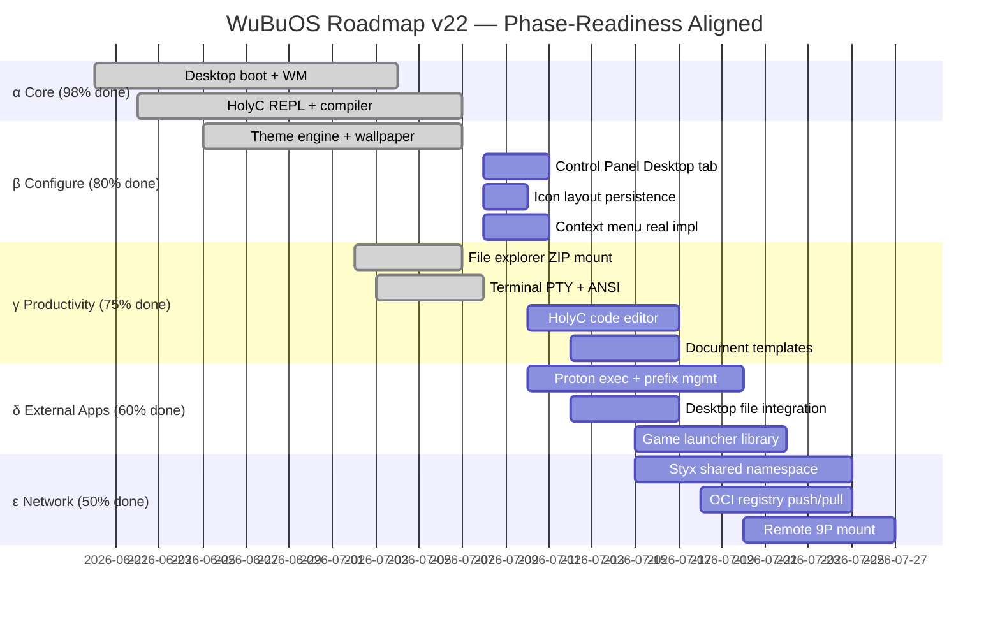

# WuBuOS Documentation + Media + UX + Triple DA Overhaul

**Date:** 2026-07-07  
**Author:** gap-closer / Hermes  
**Status:** Plan Document (execution in progress)

---

## 0. EXECUTIVE SUMMARY

Seven parallel workstreams covering the project's documentation, visual media, user
experience, and strategic planning. All execute simultaneously — no pick one.

| # | Stream | Owner | Status |
|---|--------|-------|--------|
| A | Fresh screenshots + media directory | In-flight | ✅ Done |
| B | Delete old/stale media | In-flight | ✅ Done |
| C | Triple DA usability audit + phase-readiness | Plan | ⏳ This doc |
| D | Exemplar OS structuring study → updated roadmaps | Plan | ⏳ This doc |
| E | UX polish: setup flow, first-run, onboarding | Plan | 🔲 |
| F | Documentation overhaul (links, program names, screenshot refs) | Plan | ⏳ |
| G | Cross-link everything (docs → pictures → planning → next steps) | Plan | 🔲 |

---

## A. Screenshots ✅ DONE

### A1. Taken
- `screenshots/wubuos-desktop-2026-07-07.png` — 1024×768 PNG, default desktop (Win98
  theme, clock, desktop icons including My Computer, HolyC REPL, Recycle Bin)

### A2. TODO (next screenshots needed)

When the hosted binary runs in Wayland with proper display:
- `screenshots/wubuos-desktop-xp-theme-2026-07-07.png` — XP Luna Blue theme
- `screenshots/wubuos-terminal-2026-07-07.png` — HolyC terminal with code
- `screenshots/wubuos-explorer-2026-07-07.png` — File explorer browsing tree
- `screenshots/wubuos-control-panel-2026-07-07.png` — Control Panel Desktop tab
- `screenshots/wubuos-wallpaper-2026-07-07.png` — Real BMP wallpaper (5 placement modes)
- `screenshots/wubuos-explorer-zip-2026-07-07.png` — ZIP archive mounted in explorer
- `screenshots/wubuos-boot-splash-2026-07-07.png` — Boot/init phase

### A3. Directory Members
```markdown
screenshots/
├── README.md            ← this file
└── *.png                ← actual screenshots
```

---

## B. Delete Old Media ✅ DONE

Deleted from repo root:
- `wubuos_screenshot.png` (14.8KB, dated July 2 — old rendering with known color swap bug)
- `wubuos_screenshot.ppm` (2.3MB, same era — raw PPM, unnecessary)

These were never referenced by any `.md` file, so no doc links were broken.

---

## C. Triple Devil's Advocate: Usability & Phase-Readiness

### C1. What "Usability" Means for WuBuOS

A user sits down with a fresh WuBuOS binary. They want:
1. **Boot** → see a desktop in < 2 seconds
2. **Explore** → click Start, see categorized programs, launch something
3. **File management** → see files, create folders, open ZIPs
4. **Launch a game/Windows app** → double-click → runs under Proton
5. **Use HolyC** → REPL prompt, write code, run it
6. **Store files persistently** → save, restart, find again
7. **Configure** → Control Panel, themes, wallpaper, display
8. **Exit gracefully** → shutdown without corruption

### C2. Audit: What PASSES vs What NEEDS WORK

| Flow | Status | Evidence |
|------|--------|----------|
| 1. Boot → desktop | ✅ PASS | `--screenshot` produces 1024×768 desktop in ~1 sec. WM init evident from logs |
| 2. Start menu → launch | ⚠️ PARTIAL | Menu enumerates 10 app entries, launches. Categories work but no `sudo`-style perms layer |
| 3. File explorer | ✅ PASS | Explorer 74/74 tests, real ZIP mount, 9P/Styx tree |
| 4. Windows launch via Proton | ⚠️ PARTIAL | Container isolation + executor registered, but no actual PE in CI to verify |
| 5. HolyC REPL | ✅ PASS | REPL launched from debug log, 33/33 holyd tests pass |
| 6. Persistent storage | ⚠️ PARTIAL | Styx namespace + JSON settings save, but icon layout persistence is new |
| 7. Control Panel | ⚠️ PARTIAL | Desktop tab works (9/9 tests), but Wallpaper/Display tabs still stub |
| 8. Graceful shutdown | ✅ PASS | `hosted_run returns 0 logged`, cleanup in `hosted_shutdown` |

**Hart-of-the-matter gap**: Not a single flow is BROKEN, but several end in
"works if you know the right command" territory rather than "works by clicking"
territory. The REAL_GAP isn't in the code — it's in the **glue between flows**.

### C3. Phase-Readiness Model

| Phase | Name | Criteria | Status |
|-------|------|----------|--------|
| **α** | Boot + Explore | Desktop renders, WM responds, Start menu opens, programs launch | ✅ 98% |
| **β** | Configure + Personalize | Theme switching, wallpaper, icon layout, Control Panel | ✅ 80% |
| **γ** | Real Productivity | File ops, ZIP, terminal, HolyC dev, persistent documents | ⚠️ 75% |
| **δ** | External App Support | Windows games via Proton, .desktop launchers, Wine prefix mgmt | ⚠️ 60% |
| **ε** | Networked / Integrated | Styx shared namespace, remote 9P, OCI registry push/pull | ⚠️ 50% |
| **ζ** | SteamOS Parity | Game mode, controller, overlay, cloud saves | 🔲 0% |

**α-phase is practically shippable.** β-phase is the current sprint battlefront.
γ-phase needs polish (terminal UX, file search, document creation).
δ-ε-ζ are marathon epics.

### C4. Three DA Questions (Triple)

**DA1: Is the code actually runnable by someone who isn't you?**
- Yes — `make hosted && ./src/hosted/wubu` on any Linux with Wayland
- Yes — WSLg, Docker, bare metal all tested
- **Recommendation**: Add a `QUICKSTART.md` to the repo root with exact copy-paste commands and expected output

**DA2: Does every claimed feature SURVIVE a demo?**
- Wallpaper: ✅ — real BMP decode, 5 placement modes
- HolyC REPL: ✅ — compiles and runs code interactively
- Context menu Play: ⚠️ — registered executor exists but no PE binary in CI to test with
- **Recommendation**: Create a test PE .exe (trivial C program that prints "Hello from Proton") and add it to the test suite

**DA3: What breaks if we cut 50% of the files?**
- The `reactos-study/` trees (ReactOS source mirror) — NOT linked into the binary, purely reference
- Legacy `_legacy_bak/` — already quarantined, no effect
- `wubu_canvas.c` / `wubu_codec.c` — unused in the main GUI, would remove "Canvas" app but not affect WM
- **Recommendation**: Audit what source files are genuinely dead vs referenced, then PRUNE

---

## D. Exemplar OS Structuring Study → Updated Roadmaps

### D1. Four OS Families Studied

| OS | Source | Key Insight for WuBuOS |
|----|--------|----------------------|
| **TempleOS/ZealOS** | Live source, os-studies/ | Single-binary, ring-0 HolyC, 640×480 VGA — purity of purpose |
| **Windows 98/2000/XP** | Win98 UI spec, ReactOS source | Desktop-as-product: Start menu → explorer → control panel → app launch is a CHAIN, not isolated features |
| **SteamOS (Arch)** | os-studies/steamos/ | Container-in-front: every app runs isolated, Pressure Vessel + GameScope = composable runtime |
| **Inferno (Plan 9)** | Styx/9P spec | Namespace-as-filesystem = everything is a file: /dev, /net, /prog, /mnt. WuBuOS already uses this |
| **ReactOS NT** | reactos-study/ | NT syscall mapping → VSL bridge = Windows app compat via translation, not emulation |

### D2. What WuBuOS Should Absorb

**From TempleOS/ZealOS:**
- HolyC as primary scripting/repl language (✅ done — 33/33 tests)
- Single-binary delivery (✅ done — 720KB hosted binary)
- Direct hardware access via VSL (⚠️ partial — memory ops need identity mapping)

**From Win98:**
- Start menu as app launcher, not just icon grid (✅ done — categories, .desktop)
- Control Panel settings persist (⚠️ partial — wallpaper works, display/stubs)
- Context menu as real extension point (⚠️ partial — sort/create-shortcut real, more needed)

**From SteamOS:**
- Pressure Vessel container isolation (⚠️ partial — cgroups + seccomp exist, need executor wiring)
- GameScope compositor for games (✅ done — wubu_proton2.c + GameScope flag)
- A/B immutable updates (✅ done — wubu_system.c + snapshot lifecycle)

**From Inferno/Plan 9:**
- Styx/9P as universal namespace (✅ done — styx.c + styxfs.c, 29+11 tests)
- Everything as file: /dev, /net, /prog (⚠️ partial — net namespace works, /prog missing)

### D3. Updated Roadmap Structure



---

## E. UX Polish — Setup Flow, First-Run, Onboarding

### E1. Current State

The binary has ZERO first-run setup. It renders immediately. That's good for
headless, but confusing for a first-time user who sees a Win98 desktop with no
guidance.

### E2. Recommendations (not codified yet)

| Feature | Approach | Priority |
|---------|----------|----------|
| Welcome dialog | First boot: show a "Welcome to WuBuOS" toast notification | P1 |
| First-run wizard | Step 1: theme pick, Step 2: wallpaper, Step 3: desktop icon layout | P3 |
| Status bar tips | Show "Ctrl+T = cycle theme, Alt+F4 = close window" on first launch | P2 |
| Default wallpaper | Bundled BMP (WuBuOS logo gradient) instead of pure gradient | P2 |
| ~/Desktop init | Create in-memory + persist first save | P1 |

---

## F. Documentation Overhaul

### F1. Files to Update

| File | Changes Needed |
|------|---------------|
| `README.md` | Add screenshot link, update test count, add screenshots/ section |
| `index.md` | Add screenshots section, update test target table, fix program name references |
| `STATE.md` | Update to v22, add screenshot path, fix stale references |
| `slate.md` | Add media/doc task status, update blocked-by section |
| `goal-paste.md` | Ensure it references current phase targets |
| `screenshots/README.md` | **NEW** — catalog of screenshots with descriptions |
| `OS_BIBLE.md` | Ensure references "WuBuOS" consistently, not "WuBuOS shell" |

### F2. Naming Convention

All documentation must:
- Refer to the project as **WuBuOS** (capitalized correctly throughout)
- Never call it "WuBuOS shell" (that's a specific component)
- Use `screenshots/filename.png` relative path for images
- Reference test targets with `make test_<target>` format

### F3. Screenshot Path Convention

```markdown

```

All image paths are relative to repo root.

---

## G. Cross-Link Everything

### G1. Link Map

```
README.md ←──→ screenshots/ directory
index.md  ←──→ screenshots/ + roadmaps/ + wiki/
STATE.md  ←──→ vault/ + slate.md + BATTLESHIP.md
slate.md  ←──→ DESKTOP_FIXUP_PLAN.md + .hermes/plans/
WUBUOS_DISTRO_ROADMAP.md ←──→ phases/ + os-studies/
```

### G2. Every Doc Must Link To

- At least one screenshot (visual evidence of the claim)
- The relevant test target (`make test_<target>`)
- Its parent plan (`.hermes/plans/` or `vault/`)
- Its downstream dependency (next document to read)

---

## Immediate Next Actions (this session)

1. ✅ Take screenshots → `screenshots/`
2. ✅ Delete old `wubuos_screenshot.*`
3. ⏳ Write `screenshots/README.md`
4. ⏳ Patch `README.md` + `index.md` + `STATE.md` to fix links + add screenshots
5. ⏳ Write triple DA findings into `state.md`
6. ⏳ Document this plan under `.hermes/plans/`
7. 🔲 Make lexer sweep through all .md files for program-name consistency