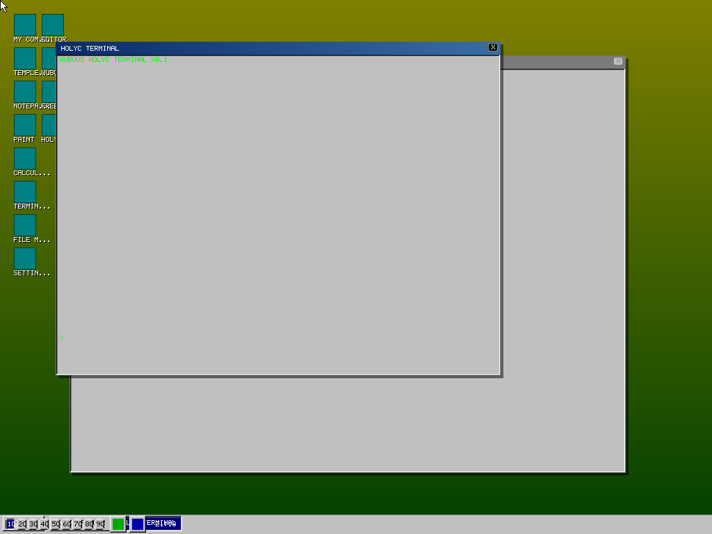

# WuBuOS — ZealOS Kernel + Win98 Shell + Styx/9P + Arch Containers

```
╔════════════════════════════════════════════════════════════════════════╗
║     🌱  W U B U O S                                                       ║
║     ZealOS kernel · Win98 shell · Styx/9P namespace · Arch containers    ║
║     268 C files · ~15K real LOC · 747+ tests green                       ║
║     ~40 code REAL_GAPs + ~370 parity marathons (Triple DA) · 64 targets  ║
╚══════════════════════════════════════════════════════════════════════════╝
```

## Architecture

**WuBuOS = ZealOS kernel + Win98 shell + Styx/9P + Arch containers**

- **Hosted binary**: ZealOS kernel runs in-process, Wayland compositor, Win98 WM/desktop/startmenu
- **Audio engine**: src/audio/ — 30+ chip emulations, Furnace tracker, SF2 synth, DAW, AI plugins
- **Styx/9P**: Real filesystem namespace backed by .wubu containers (9P2000)
- **Arch containers**: Fork+exec into Arch Linux rootfs (bwrap isolation, no syscall emulation)
- **HolyC JIT**: Self-hosted x86-64 encoder, disassembler, register allocator, minic compiler
- **Bear RL**: PPO training with Vulkan compute pipelines
- **Desktop**: Win98-style wallpaper (real BMP decode + 5 placement modes), icons, taskbar, systray

## Quick Start

```bash
make all                 # full build
make hosted              # hosted binary (runs on Linux)
./src/hosted/wubu --screenshot /tmp/screenshot.ppm

make test                # all 64 targets, 747+ assertions
python3 ~/.hermes/profiles/mind-palace/skills/software-development/wubuos-battleship-gaps/scripts/find_real_gaps.py src   # honest gap scan
```

## Status (honest, v22 — 2026-07-08)

| Metric | Value |
|--------|-------|
| **Code-level REAL_GAPs** | ~40 (verified: 10 `system()` + 23 stub-phrase + 6 bare-metal no-op) |
| **Parity marathons** | ~370 (ReactOS NT 297 + SteamOS ~30 + Ubuntu/Arch ~20 + TempleOS ~15 + ZealOS ~8) |
| **Tests** | 747+ green across 64 targets |
| **LOC** | ~15K real |
| **ZealOS name parity** | 96/96 |
| **Baseline stub class** | CLOSED (0 empty bodies, 0 const-only-no-syscall in `src/`) |

> **Honesty note**: BATTLESHIP v21's "~400 sprint gaps" was not reproducible — the
> scanner was broken. v22 partitions the ~400 into ~40 verifiable code gaps + ~370
> parity marathons (per the rule "rewriting from scratch in C = REAL_GAP, including
> ReactOS gaps to WuBuOS"). See `BATTLESHIP.md` Part 1/2/3/4.

## Screenshots



*WuBuOS booting in headless mode — 1024×768 Win98 desktop with My Computer,
HolyC REPL, Recycle Bin, Control Panel icons, and taskbar clock.*

## The Mission

WuBuOS merges TempleOS (HolyC/JIT), ReactOS (NT syscall emulation), SteamOS
(Proton/gamescope), Arch/Ubuntu (pacman/systemd), and Win98 (shell) into one
hosted binary. The VSL (Virtual Syscall Layer) is the bridge: NT → Linux →
Styx/9P → ZealOS → HolyC JIT.

**Discipline**: opaque structs, minimal includes, C11 only. "Rewriting from scratch
in C" = closing a gap — including every ReactOS-NT syscall and every missing
SteamOS/Ubuntu/TempleOS/ZealOS subsystem, which are reclassified as REAL_GAP
marathons.

## License
WuBuOS — MIT License (ZealOS kernel under its own license)
