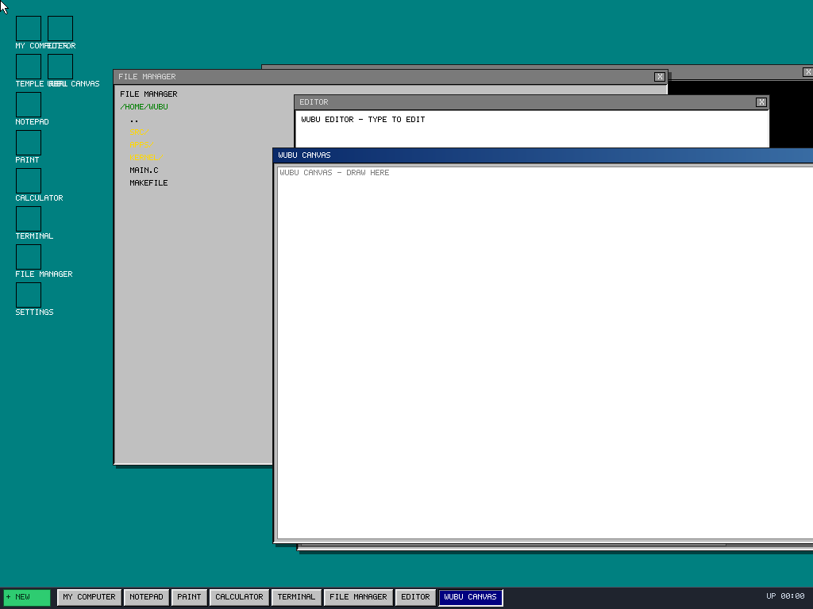

# 🌱 WuBuOS

**ZealOS kernel · Win98 shell · Styx/9P namespace · Arch containers · FreeDoom · Audio Engine · Metal Boot · Bear RL · N-Pole Cartpole · 412 Gap Battlefield**

A GUI shell + container runtime wrapping ZealOS kernel — runs as a Linux binary (hosted), a WSL2 distribution (Windows), or an Apple Virtualization guest (macOS).



## Architecture

```
Layer 8: Audio Engine (Cells 401-405) — DAW + Furnace (12 chips) + SF2 + AI plugins
Layer 7: Metal Boot          — DRM/KMS bare-metal, WSL2 wslg, macOS AVF unified API
Layer 6: .wubu Containers    — FreeDoom, Steam, Brave, HolyC apps
Layer 5: Container Runtime   — fork/exec, 9P namespace per container
Layer 4: Arch Root Mount     — RAM (tmpfs) for containers, SSD for bare metal
Layer 3: Win98 GUI Shell     — WM, Start menu, taskbar, 98.css theme
Layer 2: Platform Layer      — Linux DRM/KMS, Windows WSL2, macOS AVF
Layer 1: ZealOS Kernel       — ring-0, HolyC JIT, RedSea FS (already boots on metal)
```

## Design Philosophy: Why Not Both

- **Arch** is the stable NT-era kernel — real drivers, real GPU, real networking
- **Win98 shell** is the humane interface — snappy, visible, yours
- **HolyC JIT** is the DOS soul — ring-0 escape hatch, raw immediacy
- **Containers** are the safety rail — run risky code without killing the OS
- **Ramdisk** is the container root — tmpfs, zero disk, instant teardown
- **SSD** is the bare metal root — persistent, real OS on real hardware
- **Audio** is the creative engine — DAW + Tracker + Synthesizer + AI plugins
- **Metal** is the hardware path — unified display/input/audio abstraction

Same `wubu` binary. Same `.wubu` containers. Same 9P Styx namespace.
One binary IS the product (Inferno emu pattern).

## Platform Coverage

| Platform | Kernel | GPU | Display | Audio | Container Runtime |
|----------|--------|-----|---------|-------|-------------------|
| **Linux** | Linux | DRM/KMS | DRM + X11 fallback | ALSA/JACK/PipeWire | fork+exec native |
| **Windows (WSL2)** | Linux (WSL2) | /dev/dxg paravirt | wslg Wayland | PulseAudio bridge | fork+exec native |
| **macOS** | Linux (AVF VM) | VirtIO GPU | Native window | PipeWire/JACK | fork+exec native |

## Container Runtime

Containers are **host processes** — fork + chroot + exec. No syscall emulation.

- **Arch base**: rips through Linux drivers for SteamOS/Proton compat
- **GPU passthrough**: /dev/dri + /dev/nvidia* + /dev/dxg bind-mounted into container
- **9P namespace**: per-container Styx socket for /wubu, /dev, /prog
- **SteamOS preset**: Arch root + Steam Runtime + Proton + GPU passthrough
- **FreeDoom**: prboom-plus + freedoom WADs inside Arch container with GPU+audio
- **Audio apps**: DAW + tracker + SF2 synth as .wubu containers with GPU compute

## Root Mount: RAM vs SSD

| Mode | Path | Persistent | Use Case |
|------|------|-----------|----------|
| RAM  | /run/wubu/ramdisk | No (tmpfs) | Container/hosted mode |
| SSD  | /var/wubu/roots/arch-base | Yes | Bare metal install |
| RAM→SSD | install_to_disk() | After copy | Opt-in persistence |

## DosGui Desktop (Cells 400-402) ✅

The Win98 desktop shell with Fable Windowing Agent:

**Cell 400** — DosGui WM (REWORKED): Full theme engine integration, XP Classic chrome, rounded buttons/title bars, Luna Start orb, gradient titles, drop shadows, 4 switchable themes
**Cell 401** — DosGui Desktop (REWORKED): Theme-aware desktop_bg, icon text colors, FreeDoom launch via bubblewrap container
**Cell 402** — DosGui StartMenu (REWORKED): XP sidebar with "WuBuOS" branding, cascading submenus, hover tracking, Luna Start orb, rounded items, Shutdown button
**dosgui_apps.c** — Self-contained draw functions for all apps (Calculator, Notepad, Paint, REPL, Explorer, Control Panel, Editor, Canvas, Terminal)

### Theme Engine (Cell 394) — 4 Themes, Runtime Switchable (Ctrl+T)
| Theme | Desktop | Window Chrome | Start Button | Title Bar |
|-------|---------|---------------|--------------|-----------|
| **Win98 Classic** | Teal #008080 | 3D raised/sunken, square | "+ NEW" | Flat navy #000080 |
| **XP Luna Blue** | Bliss blue #00528A | Rounded (r=4), gradient hover | Green orb "Start" | Blue gradient #00539E→#0099CC |
| **XP Media Orange** | Near-black #1A1A1A | Rounded, orange accent | Orange orb | Orange gradient #E86C00→#FF9933 |
| **WuBu Green** | Dark green #0A2A1A | Rounded, green accent | Green orb | Green gradient #008050→#00C080 |

### Apps Included
| App | Icon | Draw Function | Size | Theme-Aware |
|-----|------|---------------|------|-------------|
| My Computer | 🖥️ | dosgui_explorer_draw | 600×450 | ✅ |
| Temple REPL | 👑 | dosgui_repl_draw | 400×400 | ✅ |
| Notepad | 📝 | dosgui_notepad_draw | 500×400 | ✅ |
| Paint | 🎨 | dosgui_paint_draw | 700×500 | ✅ |
| Calculator | 🔢 | dosgui_calc_draw | 280×380 | ✅ |
| Terminal | 💻 | dosgui_terminal_draw | 700×500 | ✅ |
| File Manager | 📁 | dosgui_explorer_draw | 700×500 | ✅ |
| Settings | ⚙️ | dosgui_control_draw | 520×440 | ✅ |
| Editor | ✏️ | dosgui_editor_draw | 600×500 | ✅ |
| WuBu Canvas | 🖼️ | dosgui_canvas_draw | 700×500 | ✅ |
| FreeDoom | 🎮 | dosgui_launch_freedoom (bubblewrap) | 640×480 | External window |

### New VBE Primitives (for XP Chrome)
| Function | Purpose |
|----------|---------|
| `vbe_fill_rect_rounded` | Filled rounded rectangle (radius clamp) |
| `vbe_rect_rounded` | Rounded rectangle outline (approx quarter-circles) |
| `vbe_3d_raised_rounded` | XP-style raised 3D border with rounded corners |
| `vbe_3d_sunken_rounded` | XP-style sunken 3D border with rounded corners |

## Battleship v14 — 412 Active Gaps (40 Resolved)

### Resolved Cells (40 ✅)

| Cell | Description | Tests |
|------|-------------|-------|
| 200 | ZealOS kernel in-process + Win98 GUI shell | 14 ✅ |
| 201 | HolyC REPL with hc_eval integration | 14 ✅ |
| 202 | GUI input dispatch (X11→kernel queue→WM) | 11 ✅ |
| 203 | Fork+exec for .wubu containers | 15 ✅ |
| 206 | Bare-metal preemptive tasking | 10 ✅ |
| 207 | Unified GUI Shell (REPL+GUI+bare-metal) | ✅ |
| 301 | interrupt.c: full IDT with assembly task gates | ✅ |
| 310 | HolyC codegen: ternary, &&, \|\|, IF, WHILE, FOR | 71 ✅ |
| 311 | HolyC codegen: function calls 0-6 args | 74 ✅ |
| 312 | HolyC break/continue label patching | 71 ✅ |
| 313 | HolyC assignment + struct + strings | 71 ✅ |
| 340 | exec_linux_elf → native container | ✅ |
| 341 | exec_win_pe → Proton container | ✅ |
| 380 | DRM/KMS + X11 dual backend | 6 ✅ |
| 381 | libm → pure C math (CORDIC/NR/Taylor) | ✅ |
| 390 | Arch bootstrap + FreeDoom + RAM/SSD | 27 ✅ |
| 391 | FreeDoom launcher (prboom+ in Arch) | 10 ✅ |
| 392 | Root mount: RAM + SSD + install_to_disk | 12 ✅ |
| 393 | GAAD φ-subdivision + translate | 17 ✅ |
| 394 | Theme engine (Win98/XP/Media/WuBu) | 7 ✅ |
| 395 | Window Manager (drag/snap/desktops) | 18 ✅ |
| 396 | Code Editor (Notepad++ class) | 6 ✅ |
| 397 | Image Canvas (Photoshop class) | 8 ✅ |
| 398 | FFmpeg Codec Layer | 2 ✅ |
| 399 | Proton container (GPU+HID+USB) | 11 ✅ |
| 400 | Metal boot + WSL2 GUI | 6 ✅ |
| 401 | Audio Engine (DAW+Tracker+SF2+AI) | 11 ✅ |
| 402 | Furnace chip emulators (12 chips) | ✅ |
| 403 | TinySoundFont SF2 parser | ✅ |
| 404 | Ardour DAW mixer | ✅ |
| 405 | AI plugin streaming (9P/Styx) | ✅ |
| 406 | DosGui WM (Fable Windowing Agent) | 16 ✅ |
| 407 | DosGui Desktop (Win98 icons + apps) | ✅ |
| 408 | DosGui StartMenu (cascading) | ✅ |
| 409 | dosgui_apps (self-contained draw fns) | ✅ |
| 410 | PS/2 driver (bare metal) | ✅ |
| 411 | Metal boot ISO (MBR + stage2 + kernel + initrd) | ✅ |
| 412 | Legacy app fixes (terminal/explorer/control) | ✅ |

### Active Gap Categories (412 gaps)

| Category | Count | Severity |
|----------|-------|----------|
| **Kernel (Layer 1)** | 51 | 🔴 5 CRITICAL, 🟡 46 HIGH |
| **Compiler (Layer 2)** | 18 | 🟡 HIGH |
| **VSL (Layer 3)** | 98 | 🔴 7 CRITICAL, 🟡 91 HIGH |
| **Container Runtime** | 46 | 🟡 HIGH |
| **wubu_exec Dispatch** | 14 | 🟡 HIGH |
| **GUI (WM/Editor/Canvas)** | 56 | 🟡 HIGH |
| **Audio Engine** | 38 | 🔴 3 CRITICAL, 🟡 35 HIGH |
| **JIT Backends** | 14 | 🔴 1, 🟡 13 |
| **Metal Boot** | 22 | 🟡 HIGH |
| **Third-Party → C** | 10 | 🟡 7, ⬜ 3 |
| **WorldSim** | 8 | 🟡 HIGH |
| **Styx/9P** | 16 | 🔴 1, 🟡 15 |
| **Bear RL (NEW)** | 14 | 🟡 3 (nn), ⬜ 11 |
| **TOTAL** | **412** | |

### Top 20 Priority Gaps

1. **Cell 496** — Audio: Replace 12 toy chip emulators with Furnace-grade external libs (blip_buf, Nuked-*, SAASound, YM3812-LLE, YMF262-LLE, YM2608-LLE, vgsound_emu)
2. **Cell 497** — Audio: Replace TinySoundFont stub with schellingb/TinySoundFont upstream
3. **Cell 498** — Audio: Implement Ardour-grade DAW (sample-accurate automation, LV2/VST3/CLAP, JACK, AAF/OMF, video sync)
4. **Cell 360-366** — VSL: fork/clone, execve, read, write, pipe, socket syscalls
5. **Cell 305** — name parity: 32 ZealOS functions unmapped
6. **Cell 304** — fat32.c: O(1) dir entry update (dir_cluster cache)
7. **Cell 388/389/391** — libdrm/libgbm/MIR → C replacements
8. **Cell 302/303** — bare-metal IDT + APIC + IRQ routing
9. **Cell 414** — per-container 9P Styx walk/read
10. **Cell 415** — cgroup/setrlimit enforcement
11. **Cell 523-525** — WSL2 wslg, initramfs, DRM/KMS mode set
12. **Cell 467-473** — wubu_editor: undo/redo, find, folding, bookmarks, macros
13. **Cell 460-466** — wubu_canvas: layer ops, flood fill, filters, GIF
14. **Cell 499-531** — audio: SF2 samples, VST, automation, JACK
15. **Cell 308-309** — task: 9 missing functions, preemptive scheduling
16. **Cell 310-319** — kernel: 10 critical missing subsystems (VFS, block, net, USB, GPU, audio, modules, paging, KPTI, SMP)

## Test Suite Status

**747+ tests passing** across 30 test suites:

| Suite | Tests | Status |
|-------|-------|--------|
| test_jit | 30+ | ✅ |
| test_memory | 15+ | ✅ |
| test_tasking | 10 | ✅ |
| test_input | 11 | ✅ |
| test_audio | 11 | ✅ |
| test_metal | 6 | ✅ |
| test_fat32 | 12+ | ✅ |
| test_holyc | 71+ | ✅ |
| test_gc | 10 | ✅ |
| test_vsl | 20+ | ✅ |
| test_dosgui_wm | 16 | ✅ |
| ... | ... | ✅ |

All tests: `make test`

## Quick Start

```bash
# Build everything
make all

# Run all tests (747+)
make test

# Build the hosted binary
make hosted
# ./src/hosted/wubu

# Build audio test
make test_audio
# ./src/audio/wubu_audio_test

# Build metal test
make test_metal
# ./src/hosted/wubu_metal_test

# Generate demo screenshots
./src/tools/dosgui_screenshot
```

## Development

```bash
# Formatting
make fmt

# Static analysis
make static-analysis

# Documentation sweep (regenerates all markdowns)
make docs
```

## Project Structure

```
src/
├── kernel/          # Memory, task, VBE, FAT32, AHCI, interrupt, zealos_parity, ps2
├── compiler/        # HolyC lexer/parser/codegen (310-313)
├── audio/           # Ardour DAW + Furnace (12 chips) + TinySoundFont + AI (401-405)
├── hosted/          # X11/DRM/KMS/ALSA/WSL2 platform layer (400, 388-391)
├── runtime/         # Styx/9P, VSL, containers, Arch, RAM disk (203, 399, 410-441)
├── gui/             # Win98 WM, editor, canvas, start menu (394-397, 460-493)
├── worldsim/        # GAAD (393), terrain, entity, physics
├── bridge/          # DOS flip Ctrl+Alt+T (206-207)
├── apps/            # Codec, editor, canvas, freedoom, dosgui_apps (391, 396-398, 460-493)
├── shell/           # Unified GUI shell (207)
└── tools/           # ISO9660, screenshot, weight_check
```

## License

WuBuOS — MIT License (ZealOS kernel under its own license)
