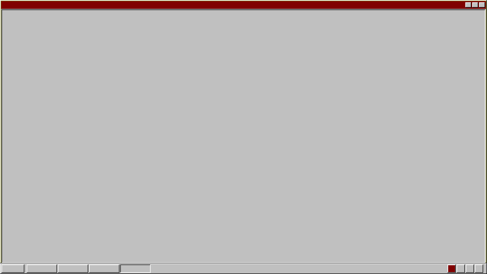

# 🌱 WuBuOS

**ZealOS kernel · Win98 shell · Styx/9P namespace · Hosted binary**

A GUI shell + container runtime wrapping ZealOS kernel — runs as a Linux binary (hosted) or standalone (bare-metal via ZealOS boot).



## Architecture

```
Layer 5: .wubu Containers  — SteamOS, Brave, HolyC apps
Layer 4: Container Runtime — fork/exec, 9P namespace per container
Layer 3: Win98 GUI Shell   — WM, Start menu, taskbar, 98.css theme
Layer 2: Platform Layer    — Linux X11/Wayland, Windows Win32, bare ZealOS
Layer 1: ZealOS Kernel     — ring-0, HolyC JIT, RedSea FS (already boots on metal)
```

## Container Runtime

Containers are **host processes** — fork + chroot + exec. No syscall emulation.
- **Arch base**: rips through Linux drivers for SteamOS/Proton compat
- **GPU passthrough**: /dev/dri + /dev/nvidia* bind-mounted into container
- **9P namespace**: per-container Styx socket for /wubu, /dev, /prog
- **SteamOS preset**: Arch root + Steam Runtime + Proton + GPU passthrough

## Status

| Component | Tests | What's Real |
|-----------|-------|-------------|
| Kernel stubs (mem, task, vbe, fat32, ahci, txfs) | 109 ✅ | Struct inits, no real HW |
| JIT mmap stub | 20 ✅ | a+b/a*b only |
| HolyC compiler skeleton | 41 ✅ | Lex/parse, no real codegen |
| .wubu container + VSL + Proton | 108 ✅ | API surface, no process creation |
| Styx/9P2000 + StyxFS | 40 ✅ | **Real** message serialization |
| GUI (WM + dbuf + start menu + theme) | 56 ✅ | **Real** pixel rendering |
| DOS flip bridge (Ctrl+Alt+T) | 13 ✅ | **Real** X11 key → mode switch |
| Hosted binary (Cell 200) | 14 ✅ | **Real** kernel init + GUI shell + input routing |
| Container runtime (Cell 203) | 15 ✅ | **Real** fork+exec + exit codes + kill |
| Package manager + compilers | 15 ✅ | Registry, no real installation |
| **Total: 32 C files** | **468+ ✅** | **~13K real LOC** |

## Battleship Progress

| Cell | Description | Status |
|------|-------------|--------|
| 200 | ZealOS kernel in-process + Win98 GUI shell | ✅ |
| 201 | HolyC REPL compiles + executes code | ⬜ |
| 202 | GUI dispatches input to ZealOS apps | PARTIAL |
| 203 | Fork+exec for .wubu containers | ✅ |
| 204 | Per-container 9P namespace | ⬜ |
| 205 | SteamOS container with GPU passthrough | ⬜ |
| 206 | Bare-metal boot | ⬜ |
| 207 | Integration test: wubu runs, GUI appears, REPL works | ⬜ |

## Quick Start

```bash
# Build everything
make all

# Run tests (468+)
make test

# Build the hosted binary
make hosted

# Run WuBuOS as a Linux app
./src/hosted/wubu            # X11 window with Win98 desktop
./src/hosted/wubu -h         # Headless (Styx server)
./src/hosted/wubu -t         # Temple REPL full-screen

# Run container tests
make test_host_exec
```

## ⚠️ Hard-Dive Reality

WuBuOS has 468+ passing tests. Cells 200 and 203 are verified at runtime with behavioral tests. Remaining cells (201-207 except 203) track real behavioral gaps. See `docs/risk_register.md` for details.
